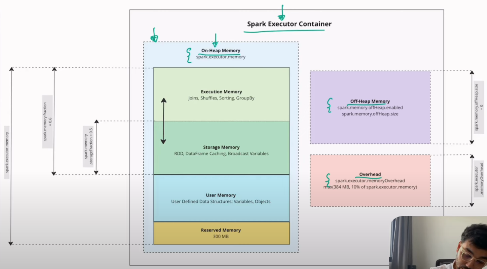
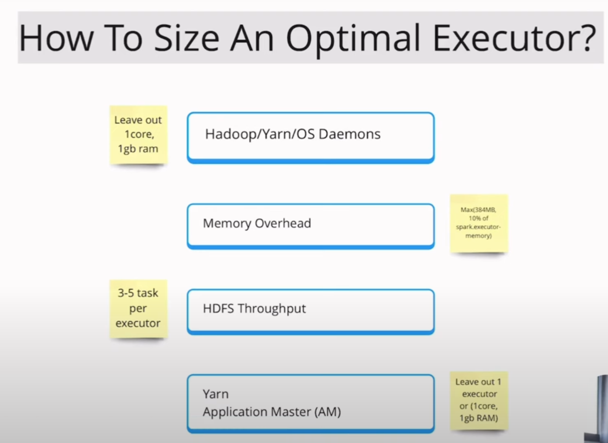

# Prerequisite
Using basic:
-  Python
-  pyspark

# Tuning PySpark

Tuning PySpark is the process of optimizing performance and reducing runtime for Spark jobs, especially beneficial when working with large datasets. PySpark tuning helps in utilizing resources efficiently, reducing operational costs, speeding up processing, and improving scalability. This project provides a guide to popular tuning methods for PySpark to achieve maximum performance.

## Table of Contents

1. [Introduction](##introduction)
2. [Memory Tuning](##memory-tuning)
   - Adjusting memory for executors and driver
   - Configuring memory settings and using memory management techniques
3. [Shuffle Tuning](##shuffle-tuning)
   - Reducing time and cost of shuffle operations
   - Adjusting number of partitions and optimizing shuffle operations
4. [Data Serialization](##data-serialization)
   - Choosing efficient data formats and serialization techniques
5. [Executor Tunning](##Executor-Tunning)
   - Config executor, mem, core
6. [Troubleshooting and Debugging](##troubleshooting-and-debugging)
   - Tools and methods for monitoring and debugging

## 1. Introduction

This project covers various methods for optimizing PySpark performance. PySpark tuning includes adjusting memory, optimizing shuffle operations, managing parallelism, and more. By tuning each aspect, we can enhance performance and scalability.

## 2. Memory Tuning



### 2.1 On heap memory
In Spark, memory within each executor is divided into main components serving different purposes. Here is a detailed explanation of each memory component in Spark:

#### 1. Execution Memory
   
-   Function: Used to store intermediate data during computation tasks such as `join`, `sort`, `aggregation`, and `shuffle`. When a task requires temporary storage for calculations, this data is held in Execution Memory.
-   Management: Execution Memory is dynamic and can share space with Storage Memory (thanks to Unified Memory). It will reduce the size of Storage Memory if additional memory is needed for computations.
-   Note: Lack of Execution Memory can cause “spilling” — data is temporarily written to disk, which can reduce performance.

#### 2. Storage Memory

-   Function: Used to store `cached` (buffered) data, broadcast variables, and objects that need to be retained across tasks (such as cached DataFrames or RDDs). Storage Memory is crucial for applications that reuse the same data multiple times.
-   Management: Like Execution Memory, Storage Memory is also dynamic and can relinquish space to Execution Memory when necessary. If Storage Memory exceeds its capacity, Spark will evict or free up the least-used data.
-   Note: Ensuring sufficient Storage Memory for cached data helps prevent Spark from evicting data or moving it to disk, which can impact performance.

#### 3. Reserved Memory

-   Function: Reserved specifically for Spark's internal tasks, such as storing system objects and managing executor information. Reserved Memory is typically quite small and not configurable, but it ensures that Spark always has enough memory for these internal needs.
-   Management: Reserved Memory does not share space with other memory blocks. The size of Reserved Memory is usually fixed and occupies a small portion of the total memory.
-   Note: This memory is not adjustable by the user, as it is crucial to Spark’s stability and for meeting its system requirements.

#### 4. Unified Memory Management
   
Since Spark version 1.6, Unified Memory Management allows Storage Memory and Execution Memory to share the same memory pool. This increases the efficiency of Spark’s memory resources:

When Storage Memory is not fully used, the remaining portion can be allocated to Execution Memory and vice versa.
Memory can be split based on the parameters spark.memory.fraction (the total fraction used by Execution and Storage) and spark.memory.storageFraction (the ratio between Execution and Storage within this portion).

### 2.2 Off heap memory

In Spark, off-heap memory refers to memory that is allocated outside of the Java Virtual Machine (JVM) heap. Off-heap memory can improve Spark's performance and reduce memory management issues like `garbage collection (GC)`overhead, which can impact tasks with large datasets.

Key Aspects of Off-Heap Memory in Spark
#### 1. Why Use Off-Heap Memory?

-   Reduce Garbage Collection (GC) Overhead: One of the main challenges with large-scale data processing in JVM-based systems like Spark is managing the overhead from frequent garbage collection. By moving some data off-heap, Spark reduces the pressure on the JVM heap and minimizes GC-related pauses.
-   Memory Efficiency: Off-heap memory allows Spark to work directly with native memory, which can be more memory-efficient, especially for serialized data.
-   Improved Performance: Off-heap memory can boost performance, particularly in tasks involving large amounts of data that would otherwise trigger GC frequently.

#### 2. Off-Heap Memory Settings in Spark

To use off-heap memory in Spark, you need to enable it and configure its allocation. Key parameters include:

-   Enable Off-Heap Memory (spark.memory.offHeap.enabled): Set this parameter to true to allow Spark to use off-heap memory.
```sh
spark.conf.set("spark.memory.offHeap.enabled", "true")
```
-   Configure Off-Heap Size (spark.memory.offHeap.size): This parameter specifies the total off-heap memory available for Spark. It should be set according to your application’s memory requirements and the available physical memory.

```sh
spark.conf.set("spark.memory.offHeap.size", "4g")
```


#### 3. Use Cases for Off-Heap Memory

-   Serialization Optimization: Off-heap memory is often used for storing serialized data, as it allows Spark to manage data outside the JVM heap, reducing serialization and deserialization costs.
-   Efficient Caching: Off-heap memory can cache intermediate data, especially when using operations that require repeated access to cached data.
-   Resouce Isolation in Multi-Tenant Environments: In systems where multiple Spark applications run concurrently, off-heap memory provides better control over resource allocation, ensuring that one application doesn’t consume all available JVM memory.

#### 4.Trade-offs and Considerations

-   Native Memory Limitations: Off-heap memory is limited by the physical memory of the system. If you allocate too much off-heap memory, it can affect other applications and processes on the machine.
-   Increased Complexity: Configuring and managing off-heap memory can add complexity to memory management in Spark. Proper monitoring and tuning are essential.
-   Not Suitable for All Workloads: While off-heap memory can benefit tasks with high memory demands, it might not be necessary for smaller tasks or those not suffering from GC overhead.


## 3. Shuffle tunning

In Spark, shuffle tuning refers to optimizing operations related to shuffle – the process of redistributing and moving data between tasks. Shuffle can be resource-intensive in terms of time and system resources, especially when dealing with large datasets or performing complex computations like joins and aggregations. Below are the techniques to optimize shuffle in Spark:

### 1. Optimize the Number of Partitions (Partition Tuning)
-   Use spark.sql.shuffle.partitions: This parameter sets the number of partitions when performing shuffle operations (like joins, groupBy, etc.). The default value is often 200, but it can be adjusted based on the data size and cluster configuration.
  
```sh
spark.conf.set("spark.sql.shuffle.partitions", "100")
```
-   Align partitions with data scale: The number of partitions should be sufficient to split the data without generating too many small files, while still fully utilizing computational resources. If the number of partitions is too low, it may cause some partitions to hold too much data, leading to delays and uneven load distribution.
### 2. Use Broadcast Join to Reduce Shuffle
-   Broadcast Join: When one of the tables in a join operation is small, you can broadcast (distribute) that table to all executors to avoid shuffling both tables.
  
Enable broadcast join by setting spark.sql.autoBroadcastJoinThreshold to the maximum size of the small table:
```sh
spark.conf.set("spark.sql.autoBroadcastJoinThreshold", "10MB")
```

Alternatively, use broadcast() in the join operation:
```sh
from pyspark.sql import functions as F
small_df = spark.table("small_table")
large_df = spark.table("large_table")
joined_df = large_df.join(F.broadcast(small_df), "key")
```

### 3. Adjust Shuffle Memory Allocation
-   Use shuffle memory effectively: The memory available for tasks in Spark includes space for both computation and storage, including shuffle. You can adjust memory parameters to optimize shuffle processing:

```sh
spark.conf.set("spark.memory.fraction", "0.6")  # Increase or decrease depending on computational and storage needs
```
-   Optimize shuffle write buffer: The spark.shuffle.file.buffer controls the buffer size when writing shuffle data to disk. Increasing the buffer size can reduce the number of disk writes and improve performance.

```sh
spark.conf.set("spark.shuffle.file.buffer", "32k")  # Default is 32k, but can be increased to reduce write load
```

### 4. Optimize I/O with Off-Heap Memory
-   Spark can use off-heap memory for shuffle data, helping reduce the impact of garbage collection (GC) overhead on JVM memory.
-   Configure spark.memory.offHeap.enabled and spark.memory.offHeap.size to enable and set the off-heap memory size for shuffle.

```sh
spark.conf.set("spark.memory.offHeap.enabled", "true")
spark.conf.set("spark.memory.offHeap.size", "4g")
```
### 5. Optimize Shuffle Sort and Merge
-   Use shuffle consolidation: Spark can reduce the number of files written to disk during shuffle by consolidating multiple smaller files into larger ones. The spark.shuffle.consolidateFiles parameter helps merge files to reduce the number of output files and improve I/O performance.

```sh
spark.conf.set("spark.shuffle.consolidateFiles", "true")
```
-   Optimize shuffle type: Spark supports different types of shuffle (sort-based, hash-based, Tungsten sort shuffle). Adjusting the shuffle type can help improve performance. For example:

```sh
spark.conf.set("spark.shuffle.manager", "SORT")  # Use sort-based shuffle to speed up proce
```


## 4. Data Serialization
Data serialization in Spark refers to the process of converting complex data structures (like objects, collections, or entire datasets) into a format that can be efficiently transmitted or stored. Serialization is crucial in distributed systems like Spark because it enables data to be moved between nodes, persisted to disk, or cached in memory. Choosing the right data formats and serialization techniques can significantly impact performance, especially when dealing with large datasets.

### Choosing Efficient Data Formats and Serialization Techniques
#### 1. Choosing the Right Data Format
The format used for data storage and transmission plays a critical role in performance, both in terms of speed and storage efficiency. The commonly used data formats in Spark include:

-   Parquet: A columnar format that provides excellent performance for analytics workloads. It supports efficient compression and encoding, and is optimized for reading and writing large datasets. Parquet also preserves schema, making it ideal for Spark's SQL engine.
When to use: When working with large structured datasets, particularly when you need to store and query data in an efficient manner (especially with Spark SQL).
```sh
df.write.parquet("data.parquet")
```
-   ORC: Another columnar storage format, similar to Parquet, but specifically optimized for use with Hive. ORC provides better performance in certain use cases due to its optimized compression and indexing.
When to use: If you're working in a Hive-centric environment or need highly compressed data for read-heavy analytics tasks.
```sh
df.write.orc("data.orc")
```

-   Avro: A row-based storage format that is compact, fast, and provides a rich schema evolution mechanism. It's often used in streaming applications.
When to use: For scenarios requiring schema evolution or when you're working with Apache Kafka.
```sh
df.write.format("avro").save("data.avro")
```

-   JSON: A flexible, human-readable format, but it can be inefficient for large-scale data processing due to its verbosity.
When to use: When working with semi-structured data or exchanging data with external systems.
```sh
df.write.json("data.json")
```

-   CSV: A simple, widely supported format, but it lacks the efficiency of columnar formats like Parquet or ORC.
When to use: When interoperability with external tools or simplicity is more important than performance.
```sh
df.write.csv("data.csv")
```

#### 2. Serialization Techniques in Spark
Serialization in Spark is responsible for converting the data into a format suitable for storage or transmission. Efficient serialization is important for both performance and memory utilization, especially when working with large amounts of data across a cluster.

-   Java Serialization: The default serialization mechanism in Spark is Java serialization, but it is not the most efficient in terms of speed or storage size. Java serialization is flexible but slow and can lead to large memory overhead.
When to use: When interoperability with other Java applications is required, but it's generally discouraged for performance reasons.
How to configure: Java serialization is used by default in Spark, but you can explicitly configure it:
```sh
spark.conf.set("spark.serializer", "org.apache.spark.serializer.JavaSerializer")
```

-   Kryo Serialization: Kryo is a more efficient serialization mechanism in Spark. It is faster and produces smaller serialized objects compared to Java serialization. Kryo is highly recommended when working with large datasets and custom objects.
When to use: For performance-critical applications, especially when custom objects are involved or when you need high-speed serialization.

How to configure:
```sh
spark.conf.set("spark.serializer", "org.apache.spark.serializer.KryoSerializer")
spark.conf.set("spark.kryo.registrator", "com.myapp.MyKryoRegistrator")
```

You can register custom classes with Kryo to improve performance further:
```sh
spark.conf.set("spark.kryo.classesToRegister", "com.myapp.MyClass")
```

-   Compression: Compression techniques are also critical when serializing data. Spark provides multiple compression options that can help reduce disk I/O and improve the performance of shuffle operations.
Common Compression Formats:
-   Snappy: The default compression format in Spark, offering a good balance between speed and compression ratio.
-   GZIP: Provides better compression ratios but is slower in terms of compression and decompression.
-   LZO: Often used in Hadoop environments, but it can require external libraries.
You can set the compression method for your dataset:

```sh
spark.conf.set("spark.sql.parquet.compression.codec", "snappy")
```

#### 3. Data Serialization for Spark RDDs vs DataFrames
-   RDD Serialization: When working with RDDs, Spark uses Java serialization by default, but you can configure Kryo serialization for better performance.
How to configure Kryo for RDDs:
```sh
sc.getConf().set("spark.serializer", "org.apache.spark.serializer.KryoSerializer")
```

-   DataFrame Serialization: Since DataFrames are often used for structured data in Spark, the choice of serialization format is more flexible. For example, you can choose between Parquet, ORC, Avro, or JSON depending on the nature of your data and query requirements.
Example with Parquet:
```sh
df.write.parquet("data.parquet")
```

-   Tuning Data Serialization: The performance of serialization depends on the nature of the data. For example, serialization of primitive types is generally faster than serialization of complex objects. Using the appropriate serialization format for the data (e.g., Parquet for structured data) is critical to achieving high performance in Spark.


## 5. Executor tunning



Example : My system have 5 node, resource per node : 12 Core, 48GB ram

### 1. Leave out : example 1 Core, 1 GB ram for(Cluster Management)(Per node)

```sh
# Resoure : 12 Core, 48 GB ram
# Leave out 1 core and 1 GB ram
12 core - 1 core = 11 core
48GB - 1 GB = 47 GB
```

### 2. Memory overhead
memory overhead = max(384MB, 10% of spark.executor.memory)

### 3. Core per executor 
According to Spark, the number of cores from 3 to 5 cores is optimal for each executor.

###4. Leave out : 1 core , 1 Gb for cluster

```sh
Resource cluster :
-   Core = 11 * 5 - 1 = 54 Core
-   Ram  = 47 * 5 - 1 = 234 GB

Chose 5 core per 1 executor
- Total executor = 54/ 5 = ~10 executor
- mem per executor = 234/10 - max(384MB, 10% of spark.executor.memory) = 234/10 - 10%(234/10) = ~20GB
```

Totally, config of executor :

```sh
spark.executor.memory=20g
spark.executor.cores = 5
spark.driver.memory= 1Gb
spark.driver.cores=1

```


## 6. Troubleshooting and Debugging in Apache Spark
When working with Spark in a production environment, monitoring and debugging are essential to ensure that applications run efficiently and errors are identified and resolved quickly. Spark provides several tools and methods for monitoring the performance of your applications, as well as for debugging issues related to task failures, memory leaks, and more.

### 1. Monitoring Tools
#### a. Spark Web UI
The Spark Web UI is an excellent tool for monitoring the state of your Spark applications, viewing task details, and tracking resource usage. It provides several tabs to help debug and optimize your applications.

-   Driver and Executor Information: You can monitor details like the number of executors, memory usage, and task execution times.
-   Stages: The "Stages" tab shows the DAG (Directed Acyclic Graph) of tasks and provides information on stage execution, such as how long each stage took and whether there were any task failures.
-   Storage: This tab shows the RDDs and DataFrames that are cached in memory or persisted to disk, along with their memory usage.
-   Environment: This tab provides the configuration properties for your Spark session, including environment variables, memory settings, etc.
#### b. Spark Metrics System
Spark provides a metrics system that allows you to collect and report metrics about the cluster's health and performance. These metrics are helpful for identifying bottlenecks, understanding resource utilization, and tracking application performance over time.

-   JMX (Java Management Extensions): Metrics can be collected via JMX, which allows you to monitor JVM metrics like garbage collection, heap memory, and thread utilization.
-   Ganglia, Graphite, Prometheus: These tools can be integrated with Spark to provide advanced metrics collection and visualization.
#### c. Ganglia
Ganglia is an open-source distributed monitoring system that can collect performance metrics from Spark clusters. You can integrate Ganglia with Spark to track the resource usage of each node, such as CPU load, memory usage, and network activity. Ganglia provides a web interface to visualize these metrics.

#### d. Logs and Event Logs
Spark logs are crucial for troubleshooting errors and understanding performance issues.

-   Driver and Executor Logs: These logs can be accessed from the Spark UI or directly from the log files. They provide insights into task failures, executor failures, and any unexpected behavior in your Spark jobs.
-   Event Logs: Spark’s event logging feature allows you to track events for Spark jobs, stages, and tasks. These logs can be saved to a file or a distributed file system, and they contain a record of the runtime behavior of your Spark application.
#### e. Spark History Server
The Spark History Server is a web-based UI that allows you to view the logs and events of completed Spark applications. It is especially useful when debugging completed jobs that have already finished running but whose logs may still hold valuable debugging information.

### 2. Debugging Methods
#### a. Task Failures
When Spark tasks fail, it’s essential to understand the underlying cause of the failure. Some common reasons for task failures include:

-   Out of Memory Errors: Task failures due to running out of memory can often be identified by checking executor memory usage. If you see high memory consumption or frequent garbage collection (GC) events in the logs, you may need to increase the executor memory or use optimized memory settings.
-   Shuffle Failures: These happen when Spark cannot shuffle data between stages due to insufficient disk space, network issues, or memory problems. Check the "Shuffle Write" and "Shuffle Read" columns in the Spark UI for any performance bottlenecks.
-   Data Skew: If tasks are taking significantly longer than others, it could be a sign of data skew, where one partition has much more data than others. This can be identified by examining task duration and partition sizes in the "Stages" tab of the Spark UI.
To handle these issues:

-   Increase executor memory: Use spark.executor.memory to allocate more memory to the executors.
-   Tune shuffle operations: Use spark.sql.shuffle.partitions to adjust the number of shuffle partitions.
-   Repartition Data: Consider repartitioning data to distribute it more evenly across partitions.
#### b. Executor Failures
If executors fail, Spark may attempt to restart them. Executor failures often happen due to resource constraints, such as memory or CPU limitations, or due to task failures that exhaust retry attempts. You can investigate executor failures by checking the executor logs for error messages or by reviewing the "Executor" tab in the Spark UI.

-   Memory Issues: If an executor is running out of memory, try increasing the executor memory using spark.executor.memory.
-   Reallocation: If executors are not allocated enough CPU, try increasing the number of cores per executor using spark.executor.cores.
#### c. Driver Failures
The driver is the central coordinator in a Spark job, and failures in the driver can stop the entire job. Common causes of driver failures include:

-   Out of Memory: Like executor memory issues, if the driver runs out of memory, it can crash the application. You can tune the driver memory by using the spark.driver.memory configuration.
-   Task Failures in Driver: If the driver encounters too many task failures, it can crash. You can monitor the number of task retries and adjust settings like spark.task.maxFailures to control the maximum number of task retries before the job fails.
d. Data Skew
Data skew occurs when one or a few partitions contain much more data than others, leading to imbalanced tasks. This causes some tasks to take much longer than others, which can reduce the overall performance of your application.

-   How to detect: Look for uneven task durations in the "Stages" tab of the Spark UI. If some tasks are taking a disproportionately long time compared to others, you might have data skew.
-   How to fix:
   -   partition the data before performing a shuffle to ensure the data is more evenly distributed.
   -   Use custom partitioning logic to better distribute the data.
   -   Use the salting technique to add a random value to the key, reducing skew for key-based operations.
#### e. Garbage Collection Issues
Frequent garbage collection (GC) pauses can lead to significant performance degradation. You can monitor GC behavior in the Spark UI, and if you see long GC pauses, you may need to optimize memory usage or tweak JVM garbage collection settings.

-   JVM Options: You can adjust the JVM garbage collector settings by modifying spark.executor.extraJavaOptions or spark.driver.extraJavaOptions.
-   Off-Heap Memory: Use off-heap memory for caching large datasets to avoid excessive garbage collection overhead.

#### 3. Useful Spark Debugging Configurations
-   spark.eventLog.enabled: Enables event logging to monitor the progress of Spark jobs. It can be helpful when debugging or analyzing job performance after completion.
```sh
--conf spark.eventLog.enabled=true
```
spark.eventLog.dir: Specifies where to store the event logs for your Spark jobs.
```sh
--conf spark.eventLog.dir=hdfs://path/to/logs
```
spark.sql.shuffle.partitions: Adjust the number of shuffle partitions. Setting it too high or too low can impact shuffle performance.
```sh
--conf spark.sql.shuffle.partitions=200
```

#### 4. Best Practices for Debugging Spark Jobs
Start Small: Begin by running smaller data sets to identify issues early in development before scaling up.
Enable Logging: Make sure that detailed logging is enabled for both the driver and executors.
Use the Spark UI: Regularly check the Spark UI for signs of performance bottlenecks, such as skewed data, slow stages, or excessive GC time.
Leverage Metrics: Use Spark's metrics system to track job performance and resource utilization across nodes in the cluster.
Test Configurations: When experimenting with different configurations (memory settings, shuffle partition count, etc.), test on smaller datasets first to avoid wasting resources on larger datasets.
By using these monitoring tools and debugging techniques, you can better understand the performance and potential issues in your Spark jobs, enabling you to optimize the jobs for efficiency and troubleshoot problems when they arise.
